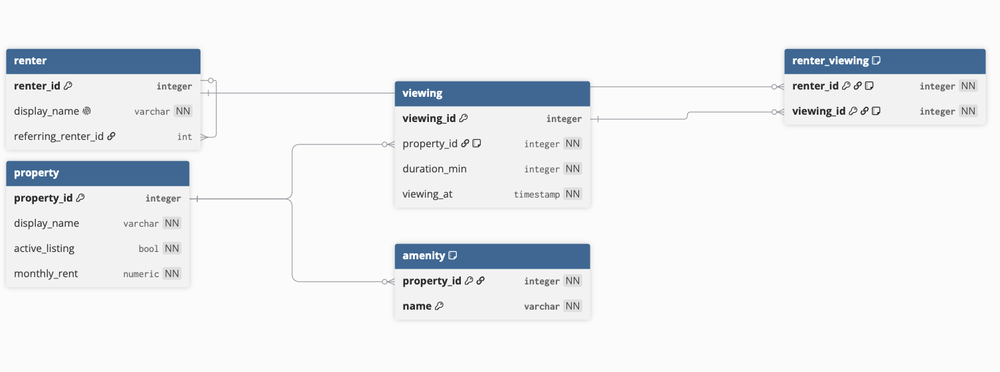

# ex603-rental-marketplace-database

## description
Repository for the rental marketplace database and related homeworks

## domain
This platform is a rental marketplace database that tracks home viewings for potential renters. The schema breaks down into 5 main entity types: 
Actor - the person viewing the home
Producer - the property being viewed
Event - the viewing event
Catalog - the amenities available for the home
Junction - the join of renters and viewings

The database is defined to answer the following questions:

- how many properties are available for rent?
- how many listings are available in a renters price range?
- what is the average duration of a viewing event?

Embed the ERD image.

## Schema

The schema is defined in `schema/schema.sql`.

### Tables

| Table | Purpose | Primary key |
|---|---|---|
| `renter` | Stores renters and their unique display names. | `renter_id` |
| `property` | Stores properties, listing status, and listing prices. | `property_id` |
| `viewing` | Stores scheduled viewing times and durations for a property. | `viewing_id` |
| `renter_viewing` | Records which renters are registered for each viewing. | (`renter_id`, `viewing_id`) |
| `amenity` | Stores the amenities associated with a property. | (`property_id`, `name`) |

### Design Decisions

1. the amenities was originally implemented with a join table on property such that the amenities were an entity type on their own. this has been collapsed into a single `amenity` table with a multi-value pattern from property. 
2. the `viewing` table was was originally implemented as the join table between `property` and `renter`. viewing was changed to be a standalone entity. we use a join table on between the viewing and renter to support multiple renters at a viewing. the property is now one to many with a viewing.
3. the `renter` table adds a self referencing column to support referrals between renters.
4. `viewing.ending_at` is a derived attribute based on `viewing.starting_at` and `viewing.duration_min`.
